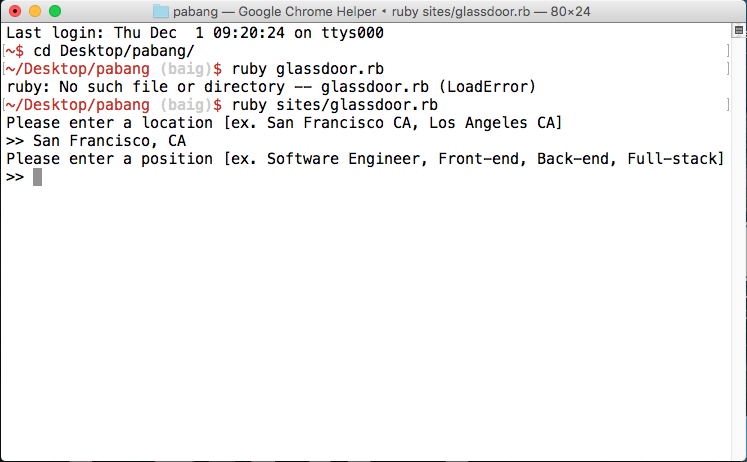
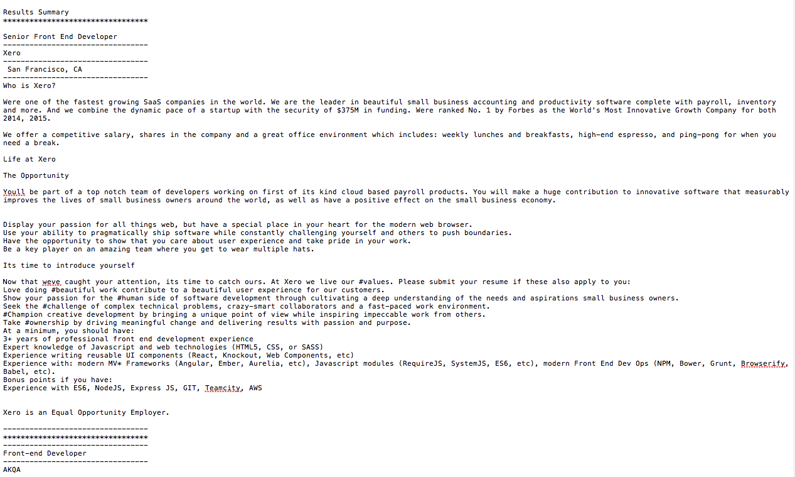

# Pabang Webcrawler

### Background

Pabang is a web browser automation script for Glassdoor that utilizes the Selenium webdriver.

Created by Humza Baig, Jay Hwang, and Michael Pak.

### Instructions

Before beginning, please have Ruby 2.3.1. installed on your machine.

1. Download the project folder

2. On command line, navigate to the root directory of the project folder

3. type `bundle install` followed by `ruby sites/glassdoor.rb`

4. Follow instructions and answer few questions

5. Watch as Pabang crawls, and scrapes job listings

6. After completion (completion time may vary), open up the `Summary.txt` file

### Description

The user input keywords that trigger their corresponding action:

[Keyword] Search Criteria
- The script take keywords, including desired job position ex.[Software Engineer, Back-end, Front-end, Full Stack], and location ex.[San Francisco, CA] which is saved and injected into the website's search bar. The webcrawler then saves all relevant job postings within the website.

[Index] Job Postings List
- The script parses through the results and stores relevant information related to the job posting ex. (Title of Job, Relevant Dates, Location). With the gathered information, the script will display a user-friendly list of all job postings that meet the search criteria.

## In the Near Future

### Additional Bonus

Upcoming Websites
- Hired
- LinkedIn

Upcoming Features
- Job Posting Criteria Keywords
The script takes additional keywords [Ruby, Python, Leadership, Teamwork] desired in the job posting.

- Job Posting Filter Keywords
The script takes additional keywords [CEO, Vice-President, No-Salary] NOT desired in the job posting.

### Final Goal

The Pabang Webcrawler creates a PASS/FAIL summary based upon keywords, results, and desired match percentage.

Summary
  - Job Title, Search Criteria, Filter Criteria
  - Pass/Fail w/ Match Percentage
    * Pass: reasons based upon Search Criteria
    * Fail: reasons based upon Filter Criteria
